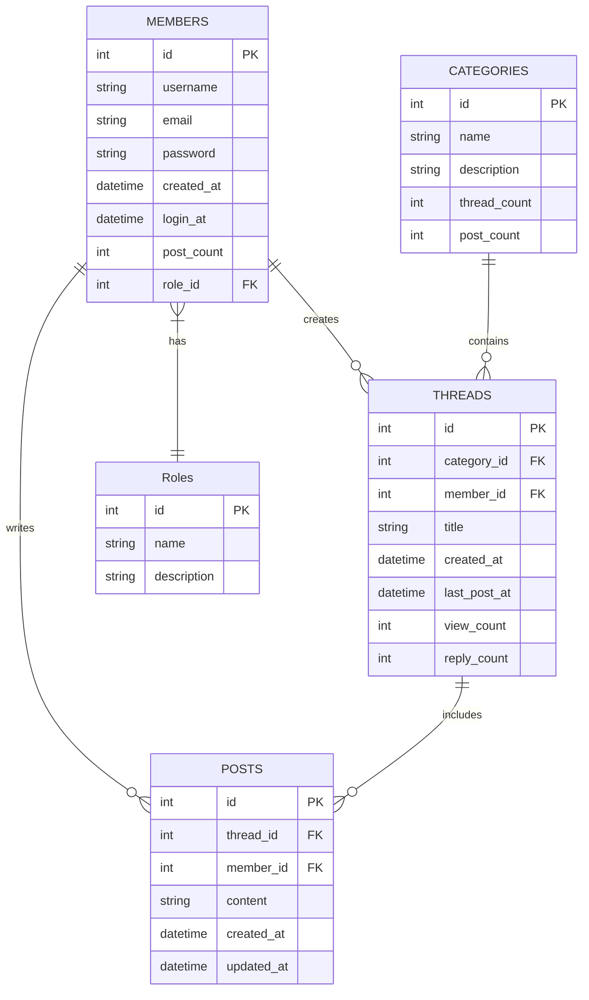

```mermaid
erDiagram
    MEMBERS ||--o{ THREADS : creates
    MEMBERS ||--o{ POSTS : writes
    MEMBERS }|--|| Roles : has
    CATEGORIES ||--o{ THREADS : contains
    THREADS ||--o{ POSTS : includes

    MEMBERS {
        int id PK
        string username
        string email
        string password
        datetime created_at
        datetime login_at
        int post_count
        int role_id FK
    }

    CATEGORIES {
        int id PK
        string name
        string description
        int thread_count
        int post_count
    }

    THREADS {
        int id PK
        int category_id FK
        int member_id FK
        string title
        datetime created_at
        datetime last_post_at
        int view_count
        int reply_count
    }

    POSTS {
        int id PK
        int thread_id FK
        int member_id FK
        string content
        datetime created_at
        datetime updated_at
    }

    Roles {
        int id PK
        string name
        string description
    }
```