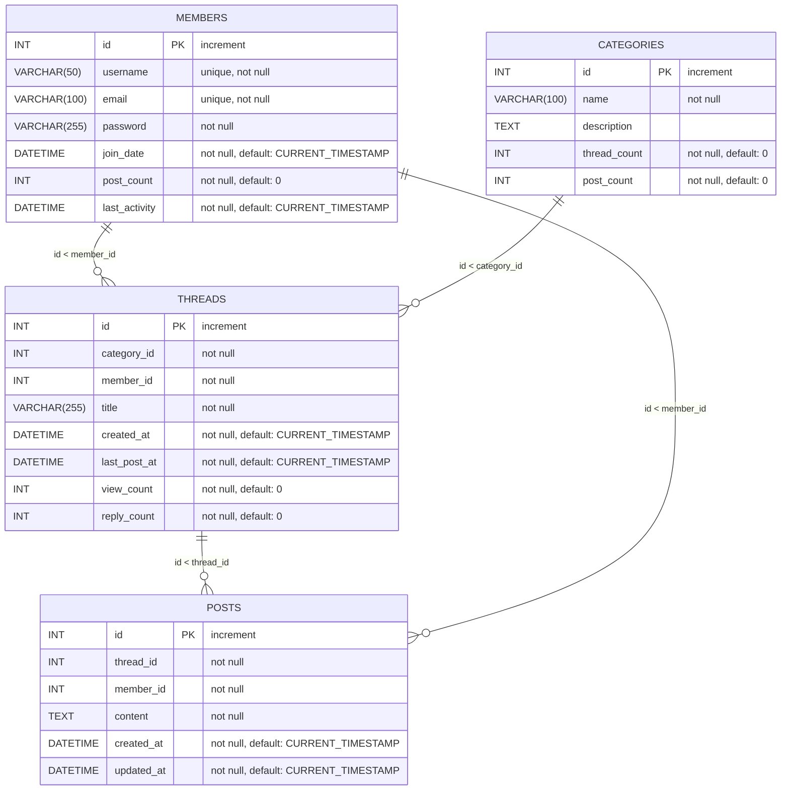

```mermaid
erDiagram
  MEMBERS {
    INT id PK "increment"
    VARCHAR(50) username "unique, not null"
    VARCHAR(100) email "unique, not null"
    VARCHAR(255) password "not null"
    DATETIME join_date "not null, default: CURRENT_TIMESTAMP"
    INT post_count "not null, default: 0"
    DATETIME last_activity "not null, default: CURRENT_TIMESTAMP"
  }

  CATEGORIES {
    INT id PK "increment"
    VARCHAR(100) name "not null"
    TEXT description
    INT thread_count "not null, default: 0"
    INT post_count "not null, default: 0"
  }

  THREADS {
    INT id PK "increment"
    INT category_id "not null"
    INT member_id "not null"
    VARCHAR(255) title "not null"
    DATETIME created_at "not null, default: CURRENT_TIMESTAMP"
    DATETIME last_post_at "not null, default: CURRENT_TIMESTAMP"
    INT view_count "not null, default: 0"
    INT reply_count "not null, default: 0"
  }

  POSTS {
    INT id PK "increment"
    INT thread_id "not null"
    INT member_id "not null"
    TEXT content "not null"
    DATETIME created_at "not null, default: CURRENT_TIMESTAMP"
    DATETIME updated_at "not null, default: CURRENT_TIMESTAMP"
  }

  MEMBERS ||--o{ THREADS : "id < member_id"
  CATEGORIES ||--o{ THREADS : "id < category_id"
  THREADS ||--o{ POSTS : "id < thread_id"
  MEMBERS ||--o{ POSTS : "id < member_id"


```
