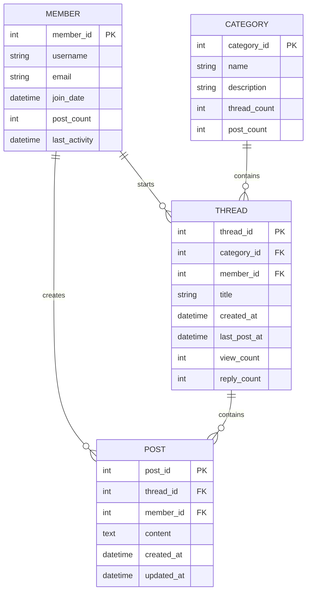

```mermaid
erDiagram
    MEMBER ||--o{ POST : creates
    MEMBER ||--o{ THREAD : starts
    MEMBER {
        int member_id PK
        string username
        string email
        datetime join_date
        int post_count
        datetime last_activity
    }
    CATEGORY ||--o{ THREAD : contains
    CATEGORY {
        int category_id PK
        string name
        string description
        int thread_count
        int post_count
    }
    THREAD ||--o{ POST : contains
    THREAD {
        int thread_id PK
        int category_id FK
        int member_id FK
        string title
        datetime created_at
        datetime last_post_at
        int view_count
        int reply_count
    }
    POST {
        int post_id PK
        int thread_id FK
        int member_id FK
        text content
        datetime created_at
        datetime updated_at
    }

```
